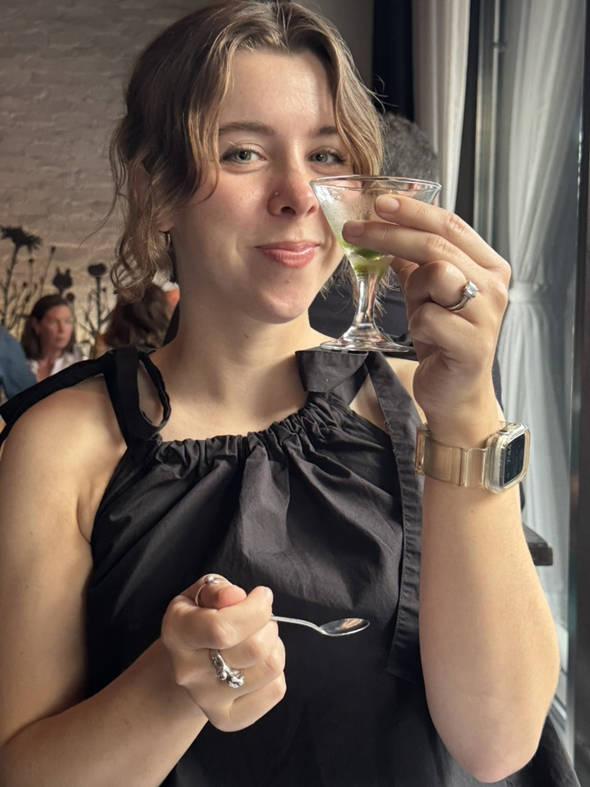

+++
date = '2025-06-10'
draft = true
title = 'Anniversary Dinner'
latitude = 40.71801557373186
longitude = -73.99070540378536
+++
It's our anniversary dinner! I chose, mostly because Sydney doesn't like to choose, but partially because I really wanted to go here.

## Nathan's Take
### Dirt Candy
I love tasting menus, but they never fill me up. This was no different, but what a fun experience! 

It's all vegetarian which is hard to come by in tasting menus. I opted for the wine pairing which was only $55 and absolutely worth it. So many funky, fun wines!
The food was incredible, every bite was different and was presented in a unique way. Spring pea curry puffs, carrot falafel in a carrot pita, caesar salad sorbet, everything was amazing. 

There were lots of "kitchen" treats too, which were off menu dishes that were being tested for the next menu. One of my favorites was a cucumber aguachile served in a tiny martini glass.

### Mace
Speaking of tiny martini glasses, we went to Mace which was recommended by a friend, and boy do they have some weird cocktails. And that's coming from me. But everything we tried was great! I had the mace cocktail which featured, you guessed it, mace! Not sure I've ever had a mace cocktail. Actually, I'm sure I haven't. 

I liked that all the cocktails featured a different central ingredient and really played that up with tinctures and liqeurs. 

## Syd's Take
