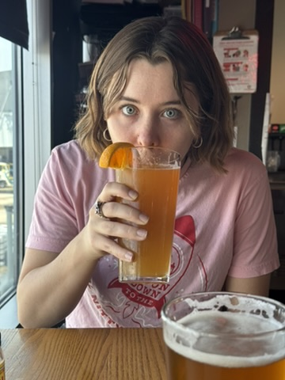

+++
date = 2025-05-29T15:00:00-04:00
draft = false
title = 'Entering the Arena'
latitude = 40.777153550
longitude = -73.87408694
gallery_images = ['beer.jpeg','plane_view.jpeg']
+++

Because of the recent Newark incidents, Syd and I decided to fly into LGA instead. What's the overunder on how long it takes to get from LGA to midtown? I say an hour. And Uber price? $100. No prizes for the winner.

We got to the airport way too early so we got a beer at _Chilji's_ (sorry, Dad).

There is nothing better than an airport beer. You have no place else to be.

The flight was super bumpy which stressed Syd and the cat down the aisle out, but we got some great views of the city!

Once we landed it was smooth sailing! We got another great view of the city from the runway.


Turns out, I was spot on with my earlier guesses! Uber was 50 minutes and $98 before tip. We were offered gum, which was nice I suppose.

In the next post, we will talk about the apartment and _big city living_.
