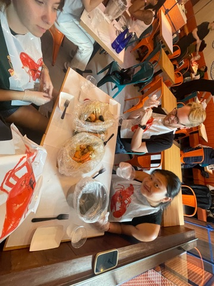
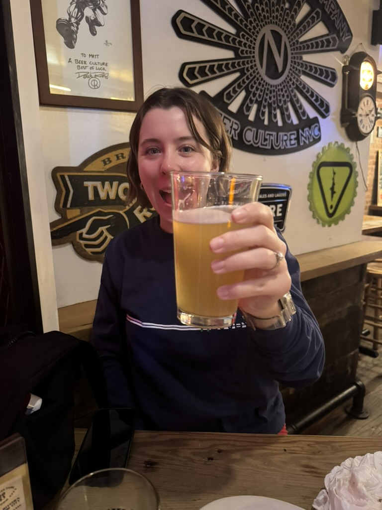
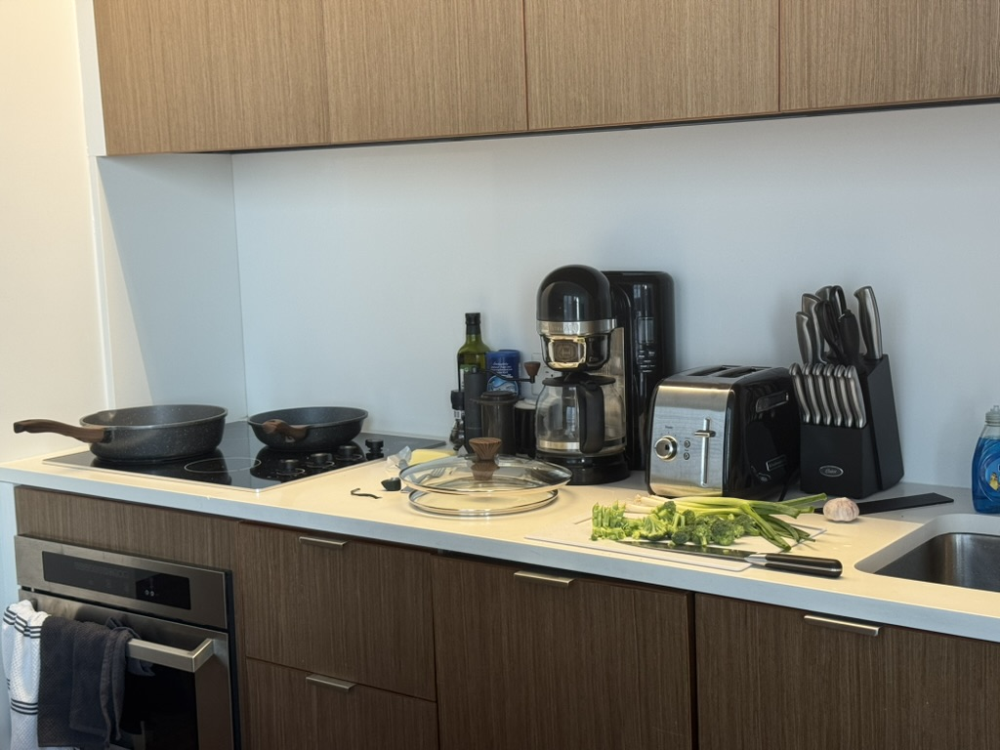

+++
date = '2025-06-07T14:50:17-04:00'
draft = false
title = 'First Week'
gallery_images = ['beer.jpeg']
latitude = 40.74032867928441
longitude = -73.99262885322231
+++

We survived the first week!! It was mostly work (onboarding for me and actual work for Sydney), but we tried to do stuff most days! 

### Monday
First day of work for me. Was a bit stressed about the subway being packed and making my connection, but it wasn't bad at all! Work was mostly introductions and icebreakers. Nothing crazy.

We went to a seafood boil ([Aqua Boil](https://maps.app.goo.gl/9opPji6VVRogVWct9)) with Sarah and her friend Julien. The food was great, but kinda expensive. Welcome to the city! 

Everyone came over to ours after and we watched Secret Lives of Mormon Wives, which is an absolutely insane show. 

### Tuesday
Still just onboarding at work, but at least I'm getting free food!

Sydney and I checked out [Beer Culture](https://maps.app.goo.gl/R1JoXLx4dUWS4KJy9) which had lots of good beers and surprisingly good (and cheap) brats. I ate some of Sydney's dregs. 

### Wednesday
First day of real work for me! Met my manager, was reading some papers, and met with my team.

First game of the Stanley Cup finals!! We went to [the Canuck](https://maps.app.goo.gl/rBD322jQt6me93oe6) which was BUSY, even though we got there an hour early! Standing room only! We stayed for the first period and then got some pizza ([Vitos](https://maps.app.goo.gl/jtVRLJRrBAci26av7)) and watched the rest at home! Go Oilers!

### Thursday 
Long day at work today, but it was productive!

First _actual_ meal we've cooked in our petite little kitchen! Stir fried some broccoli and tofu which turned out pretty good! We realized we needed some more cooking utensils though so we bought some mixing bowls and baking sheets. 

Went on a walk to find ice cream and settled on [Ben and Jerry's](https://maps.app.goo.gl/uhAdve7Cx4Sp3Ss76) which was fine! There doesn't seem to be much in the way of local ice cream places, at least not up by us. 

### Friday
WFH day for me! The whole company is WFH on Fridays, and we are supposed to be in 3 of the other 4 days. I think Mondays will probably be my other day WFH unless I need to go in for something. 

The Whitney was free tonight (like every Friday), so Syd and I went with Sarah and Seth to check it out! I was hoping to see some Edward Hopper, but they didn't have any on display!! Oh well, next time. It was not really stuff I normally like, but it was fun to go and people-watch more than anything. 

We also met up with Sarah's roommate's high-school friends at [ABC Beer Co](https://maps.app.goo.gl/VLvZY462vcACz9c8A) which was a really cool spot! They had all sorts of beers and some good looking hotdogs too (not confirmed). Getting back was a bit of a headache, but we made it! Bummer that the Oilers lost in OT2! But fun game.

### Saturday
Slow start for me after a few beers! Enjoyed my coffee and some leftover halal cart food from lunch yesterday. Glad to see Coco clinch the win at Roland Garros!

We went to SoHo to check out the Salomon store, and Sydney got some new kicks!

It started pouring rain, so we rushed to the subway, but stopped on the way back to get a bagel from [Best Bagel](https://maps.app.goo.gl/42iro65FXmc9VAsC7) which was surprisingly very good!

---
That's all for now folks!
