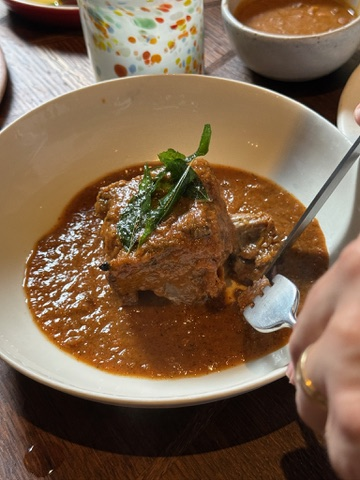
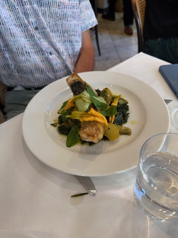
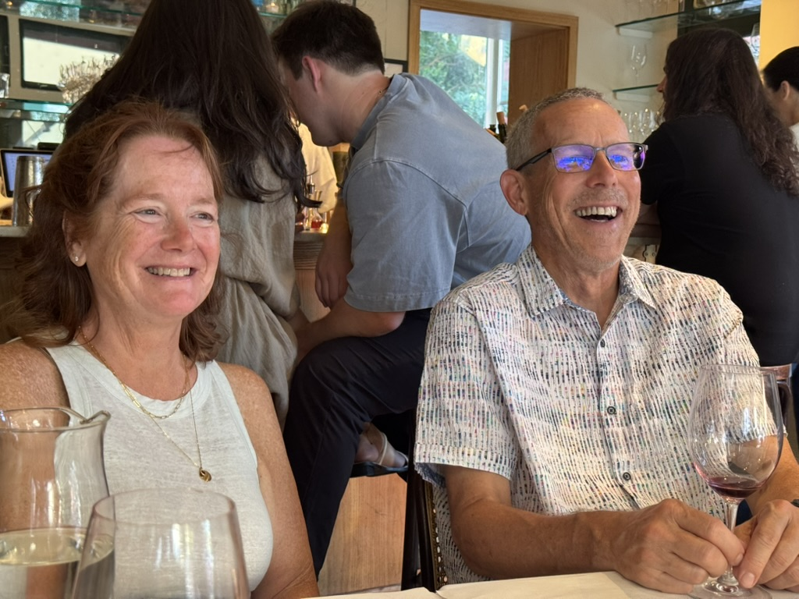
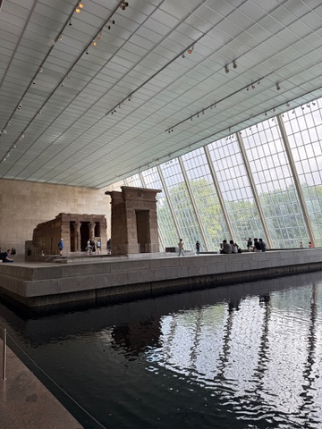
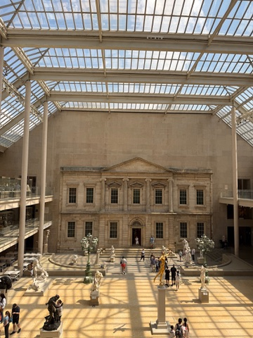
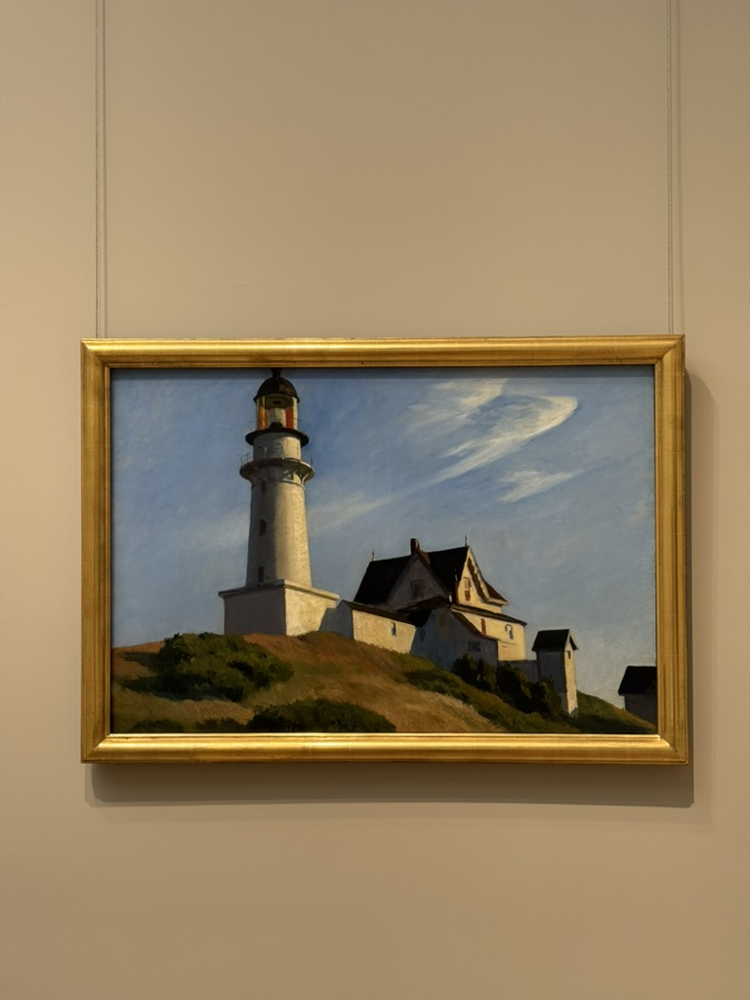

+++
date = '2025-07-30T20:12:52-04:00'
draft = false
title = 'Nathan Parents'
latitude = 40.7188671175568
longitude = -73.98999614900683
+++

My parents came to visit!! Of course we hung around and chatted plenty, but we also visited some pretty awesome spots!

## Food and Drinks
It's not a Stromberg vacation without a bunch of food and drinks. I tried to hit some of the NYT top 10 to give my parents a taste of the good life. 
### Kabawa
Chef Paul is from the Momofuku lineage. That should be enough to go. The food is generally caribbean, but focuses on Barbadan food (not that I could tell). Of course the rum list is extensive, the cocktails are strong, and the food is spicy (with spices, not so much peppers). We got a bit of everything from the prix fixe menu, including curried goat, a giant pork chop, raw shrimp, and skirt steak. 

Everything was *extremely* delicious, including the free bread course. My first Momofuku-adjacent experience and it was very good! The prix fixe felt relatively reasonable considering everything you get, but definitely on the pricey side.

### King
Another NYT top 10! King is somewhere between Italian and French, skewing towards French. Think: lots of wine, roast chicken, olives, and chickpea flour batons. The pasta changes daily and is apparently a must-get. This time it was a walnut and pesto ravioli that my mom got. Syd and I split half a roast chicken (with salsa verde and beans). My dad got some very beautiful fish (of a kind I don't remember).

We had lots of VERY good wine and had a blast chatting and people watching. 

Highly recommended, one of my top restuarants so far!

### schmuck.
This was a last-minute addition while we were waiting for Kabawa! I had walked past several times but never been in. We had early reservations at Kabawa, so we were able to get in pretty quickly to schmuck, but I bet it gets busy. All you have to know about the drinks is that my mom wouldn't stop talking about the frozen rhubarb margarita for the rest of the trip. 10/10.

## Culture
My parents went to the 9/11 memorial museum while we were at work, so no funny tower jokes, but we went to some pretty good museums still!
### The Tenement Museum
A highly underrated museum in the Lower East Side, the Tenement Museum is less of a museum and more of a preserved building with some very talented story tellers. There's nothing to see without a guided tour, with each tour taking you into a different apartment and telling the story of a different family. To walk through a building that hadn't been lived in after the mid 30s is pretty incredible, and the details were astounding. Piped decorations on the wall, layers and layers of flooring and wallpaper, well-worn wooden stairs (the reason the building was condemned). This one is highly recommended. 

### The Metropolitan Museum of Art (The Met)
Forgive me, but I did not come for the red carpet. It seems like we all had different reasons for wanting to come! Sydney wanted to see old photographs, mom wanted to see some Monets, and dad just likes to walk around. I go into every museum hoping to see a Hopper (and succeeded this time). 

We started in the Egyptian wing, which is filled with obelisks, hieroglyph-ed walls, and **A WHOLE FREAKING TEMPLE**.

There's also a whole section of mosaics, stained glass, and brozes taken out of robber baron mansions which really blew my mind.

The craziest thing I saw there was definitely *Washington Crossing the Delaware* which didn't exactly inspire patriotic feelings, but absolutely **DWARFED** every other painting I saw. I mean it must be, like, 10'x15'. Worth sitting in front of that one for a while.

I also finally got to see a Hopper in person! 

We explored some more, but there is so much, I couldn't have seen even a quarter of the rooms. And I was booking it. I'd love to go back, and highly recommend it!
