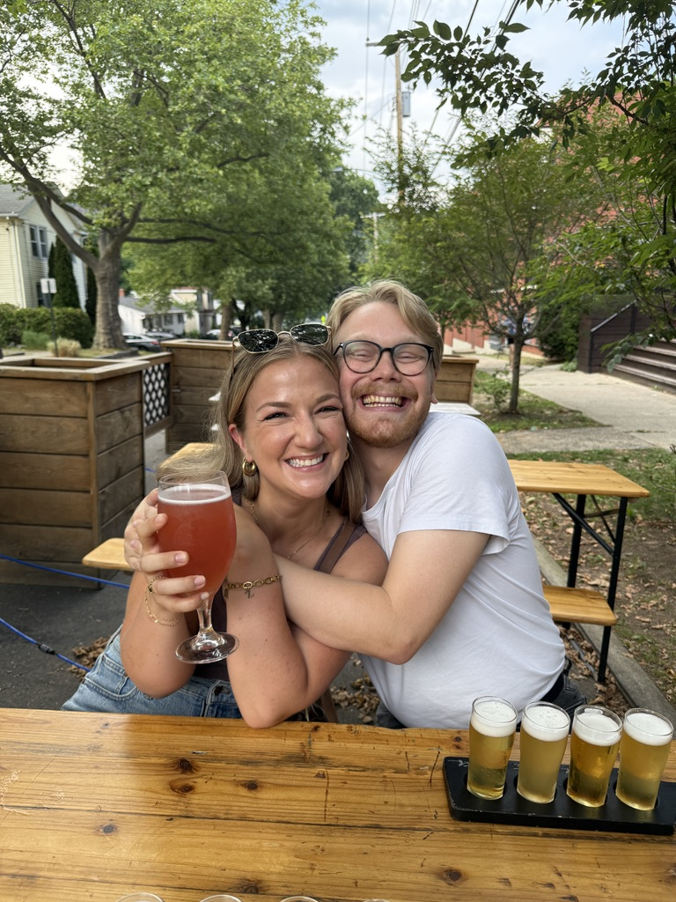
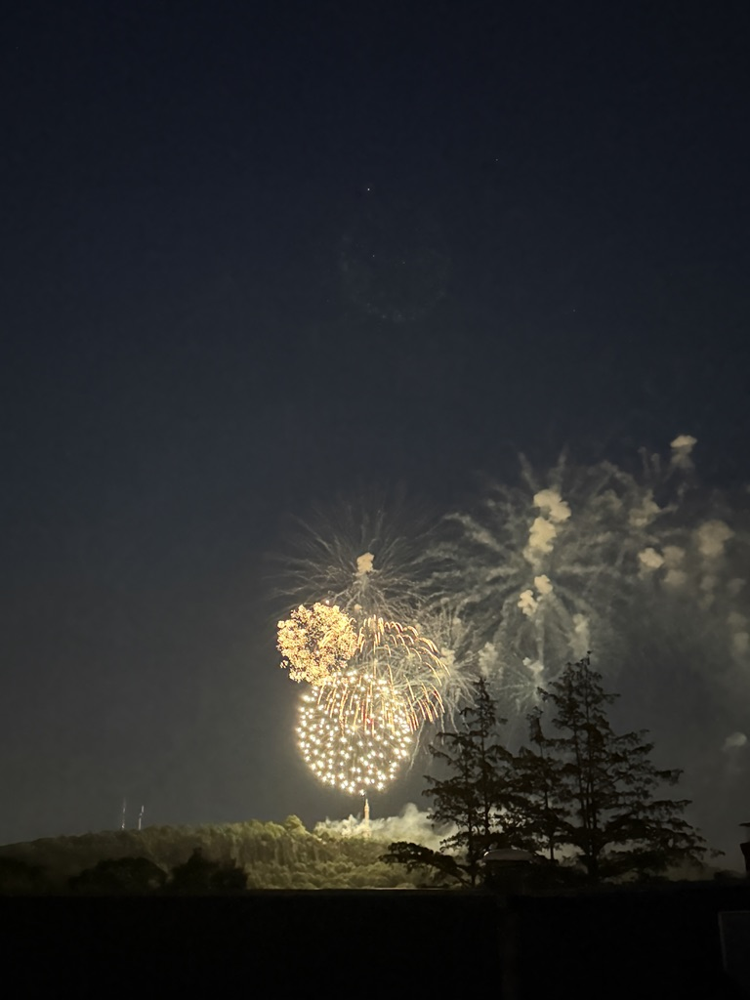
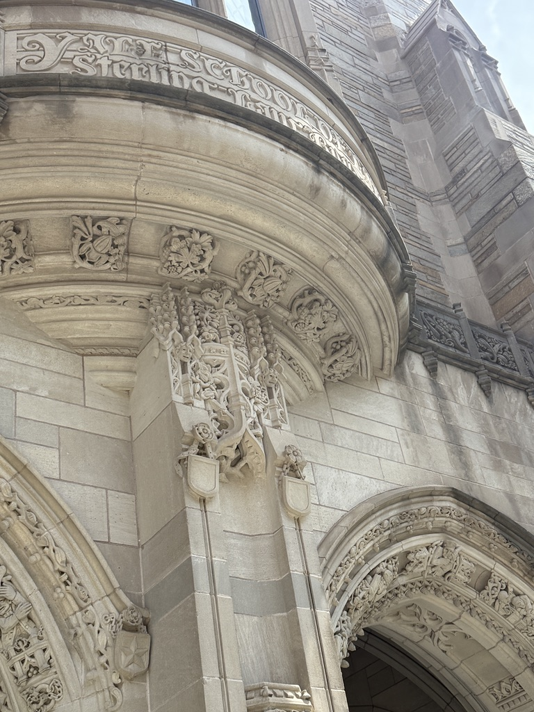
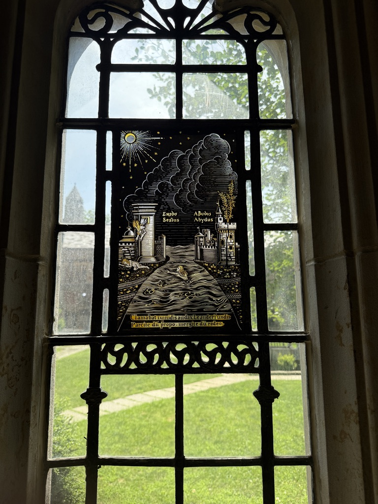
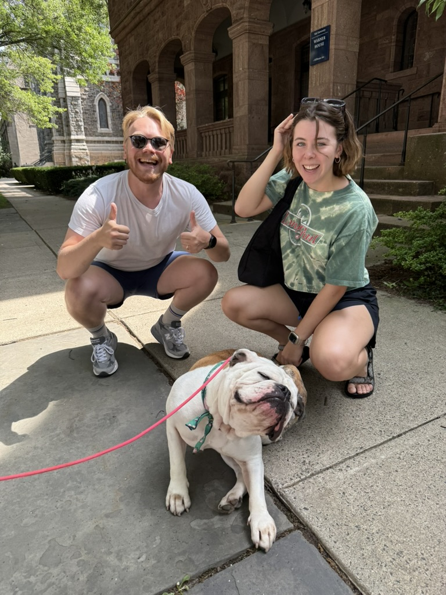
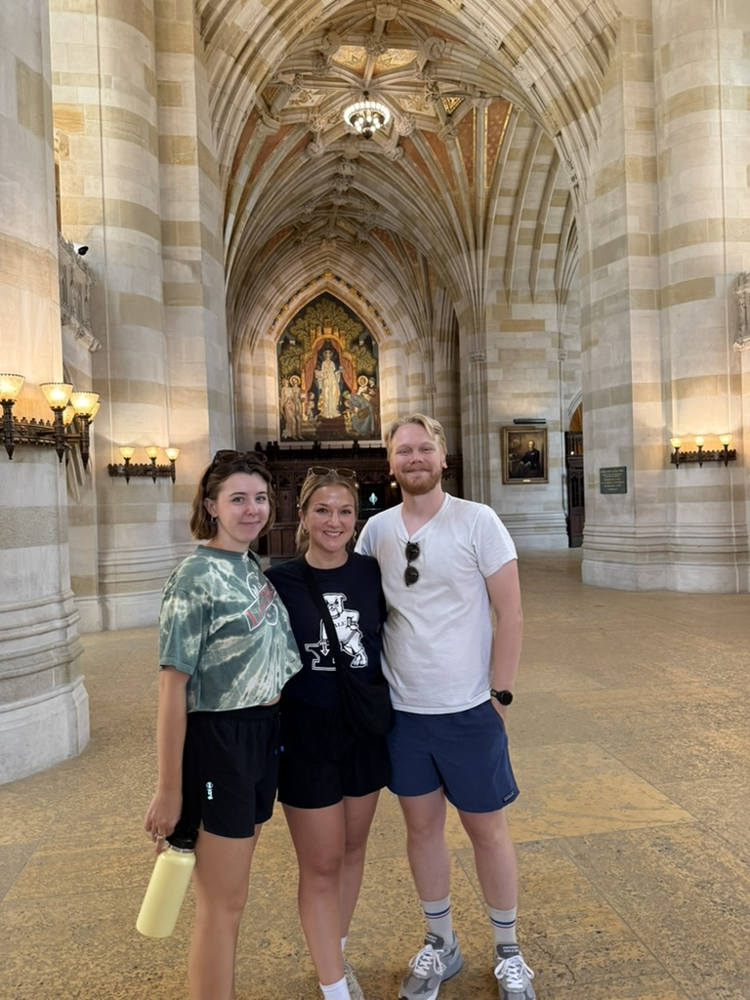

+++
date = '2025-07-03'
title = 'New Haven'
latitude = 41.30896099350832
longitude = -72.92952504663735
+++
Trip to see Holly, Will, and Handsome Dan!

## New Haven
### Train Game

We love train! Our starting point to catch the train to New Haven (which comes every 30 minutes) was Grand Central Station. It was super easy to get from the subway to the MetroNorth train line, although we allllmost got off track to try an oyster bar we spotted in the station. Chilling on the train and watching the landscape go from packed city streets to neighborhoods with gardens to vast grassy marshes was a fantastic decompression.

### Beer, Thunderstorms, A Peetz ??

Holly was the best host a guest could ask for. She knew the vibes as soon as we got in the car - a little walk and a little beer was needed. We walked over to a brewery in her neighborhood, had some flights, and yapped it up. 

Then we got clam, potato, and cheese(?) pizzas from Sally's Pizza and spend the rest of the night playing Mario Kart (Sydney rules over all, especially Will) and Guitar Hero (Holly rips and Nathan is a great backup dancer).

### Beach and blueberry icecream

The 4th was Americana at its finest. The morning and afternoon were spent at Hammonasset Beach State Park. We had sandwiches, chips, cherries, Radlers, paddle boarding, sun naps, ball throwing, and water shenanigans. Dinner was Mexican food and margs! Before fireworks, we attempted to cram in a visit to the neighborhood soft serve place for their current special - blueberry soft serve. Sydney regrets her vanilla with sprinkles decision. The line for ice cream resulted in an actual sprint back to Holly's to watch the fireworks (RIP to Will's whole body for bursting through the door to the roof in the excitement), and then sleepyheads got to rest. 

### Yale

If you need a tour of Yale, contact Holly. She knew so much about everything, had special access to buildings, and even somehow summoned Handsome Dan on a street corner. She pointed out so many details crafted into the buildings, which were insanely intricate and impressive. Sydney especially loved the carvings of sleepy students on so many of the buildings.

### THANK YOU HOLLY

We LOVE YOU HOLLY!! Truly a breath of fresh air hanging with you and Will for the weekend. Thank you for being such a fantastic and accommodating host and making us feel at home for a few days <3 

