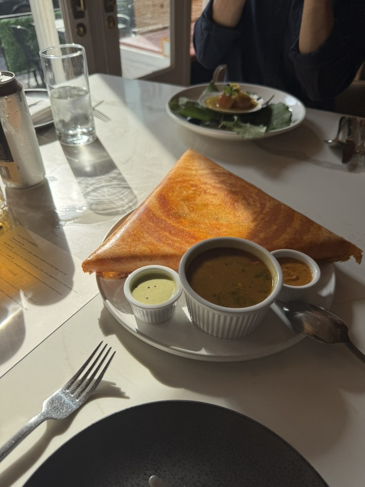

+++
date = '2025-06-18T17:31:34-04:00'
title = 'Semma'
latitude = 40.73612792517678
longitude = -74.00062827679803
+++
NYT #1! Let's see how it stacks up.

## Nathan's Take
Yum. Way different from any other Indian food I've had. Lots of black pepper and cardamom. The dosa was big, fermented, and filled with lentils! Nothing better.

The drink selection was fun, they had several collab beers with the brewery down the street which were all very good. 

Overall I thought it was delicious and exciting, but I'm not sure it's the best restaurant in NYC. I preferred [Mam](/travel-blog/posts/mam) but this was still fantastic!

## Sydney's Take
Holy crap, we are on a roll! I'm still thinking about the dosa with the spiced, mashed lentils (and potatoes?) and onions and the light dough holding it all together. The short rib and oxtail were succulent and fell right off that bone. More than the lobster, I liked the the sauce that came with the lobster (where my savory drink-heads at!?!). Definitely the best Indian food I've ever had.