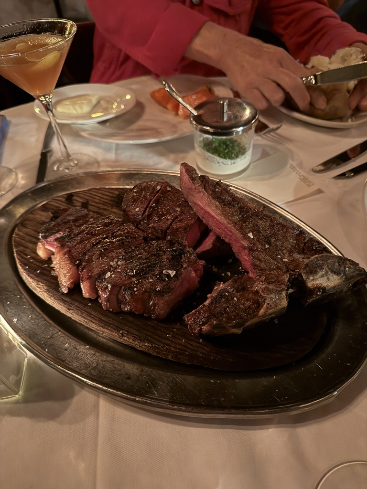

+++
date = '2025-06-13T17:31:34-04:00'
title = 'Dicks Do NYC'
latitude = 40.756500
longitude = -73.984611
+++
Syd's rentals take on the BIG CITY

## It rained but who cares!

Testing, testing: Mom or Dad if you're reading this, send me a text saying you're gonna give me the biggest hug ever.

Mama y papa seem to bring rain wherever they visit Nathan and me, but does that stop the fun? Absolutely not. Does everyone drink a little bit more to make up for lack of sunshine? Probably, yeah.

Starting the weekend off strong, we met them for drinks and dinner at their hotel, the Chatwal from *The Unbound Collection by Hyatt*. It was giving the Hollywood Hotel before it was the Tower of Terror, so really good art deco but slightly creepy. The drinks were solid and the food was solid, but I think definitely on the lower end of our list compared to the rest of the weekend. 

But high spirits for these love birds!

## NHM and middle fingers...

The day started very wholesome, very education-centered. Tectonic plates, Teddy Roosevelt, deep sea creatures, and ...climate change!! Thank you Natural History Museum!

@Mia are you quivering rn

Look at this guy <3

That's where the G-rated fun ends, folks. We headed directly to the bars after the museum (there was a 2 hour nap and snack break). My dad loved this on-fire banana cocktail so much he ordered it twice which is very on par. 

Next, we had dinner at Lola's, which I remember really enjoying, but I guess not enough to take any pictures... There were dumplings, roasted oysters, a few salads, and good cocktails.

The poor Oilers were playing that night so we tried to get a spot at the Canuck to finish watching the game, but that idea bombed after 25 minutes in a line and a few street beers. Onward and upward, we found a much less frequented sports bar to watch the game in peace. 

SIKE it wasn't peaceful - Mom and Nathan were beefing on who was more drunk.

## Rain break = Central Park peruse

Waking up bright-eyed and bushy-tailed, we spent the morning strolling through Central Park while the rain gave us a break. Highlights include:
- watching people rowboat backwards in the rowboat pond
- wandering on some very Cherokee Park-esque stone pathways through trees
- visiting the Conservatory Garden
- seeing a snapping turtle that could eat Mimi

## Keen's

Keen's is **the** iconic New York steakhouse, perfect for a dinner to finish the trip! Pipes line the ceilings and walls because it used to be a pipe lounge where the rich and famous would store their pipes and check them out for use when they visited. If I went back, I'd only order a steak (or the mutton) and a baked potato with a glass of wine - those items were fantastic. I could pass on pretty much everything else.

## Thanks for visiting!!

We love you guys and are so happy you came to see us for the weekend! I know it's very different from a Phoenix visit, but I hope you liked the food you ate and the things you saw. You're big city steppers now!!

Love you!
